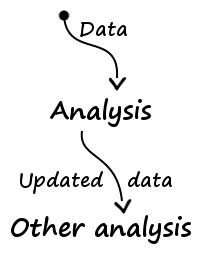
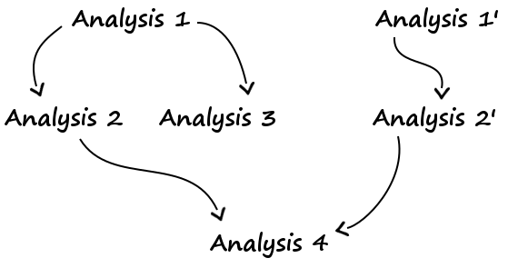

# Concepts et généralités

## Problématique

L'objectif est d'appliquer une suite d'opérations sur des données afin d'en 
extraire des informations. Ces opérations seront regroupées en **analyses**, 
lesquelles correspondent à un ensemble de traitements sur les données ayant 
pour but d'extraire des informations sur ces dernières. Par exemple, une 
analyse peut être une moyenne mobile ou une régression linéaire. L'étude des 
données revient alors à chaîner des analyses :

<p align="center">
    
</p>

Par exemple :

* Sur les productions de chaque vache pour chaque lactation en fonction du temps
    * Première série
        * Moyenne mobile
    * Deuxième série
        * Régression linéaire
        * Moyenne des erreurs des régressions
    * Troisième série
        * ARMA
* Sur les productions de chaque vache pour chaque lactation en fonction de la consommation
    * Première série
        * Moyenne mobile
    * Deuxième série
        * Régression linéaire
        * Moyenne des erreurs des régressions

En n'oubliant pas que d'autres traitements peuvent s'ajouter au cours du temps, 
on obtient alors un **graphe d'analyses** :

<p align="center">
    
</p>

Une vue devra être générée pour chaque résultat, sous quelque forme que ce soit 
(graphe, texte...), afin qu'il soit simple de faire des déductions. De plus, 
comme calculer prend du temps, un système de cache devra être mis en place.


## Structure des données

Les données sont cumulatives. Autrement dit, au fur et à mesure des analyses, 
les données s'étofferont. La structure des données pourra également être 
changée au cours du temps. Par exemple :

```python
# Original data
# All data of one cow

{
    "cow": "0001",
    "lact-1": {
        "lact": 1,
        "days": [1, 2, 3, ..., 350],
        "prods": [30, 25, 40, ..., 33],
        "cons": [11, 9, ...]
    },
    "lact-2": {
        "lact": 2,
        "days": [1, 2, 3, ..., 343],
        "prods": [14, 21, 37, ..., 25],
        "cons": [12, 8, 9]
    }
}

# Moving average

{
    "cow": "0001",
    "lact-1": {
        "lact": 1,
        "days": [1, 2, 3, ..., 350],
        "prods": [30, 25, 40, ..., 33],
        "cons": [11, 9, ...],
        "days-ma-step3": [3, 4, ..., 348],
        "prods-ma-step3": [37, ...]
    },
    "lact-2": {
        "lact": 2,
        "days": [1, 2, 3, ..., 343],
        "prods": [14, 21, 37, ..., 25],
        "cons": [12, 8, 9],
        "days-ma-step3": [3, 4, ..., 348],
        "prods-ma-step3": [30, ...]
    }
}

# Linear regression
# B = AX
# B: prods
# A: day, lactation, consumption...

{
    "cow": "0001",
    "lact-1": {
        "lact": 1,
        "days": [1, 2, 3, ..., 350],
        "prods": [30, 25, 40, ..., 33],
        "cons": [11, 9, ...],
        "days-ma-step3": [3, 4, ..., 348],
        "prods-ma-step3": [37, ...],
        "X": [...],
        "A": [...],
        "linreg-error": 12.5
    },
    "lact-2": {
        "lact": 2,
        "days": [1, 2, 3, ..., 343],
        "prods": [14, 21, 37, ..., 25],
        "cons": [12, 8, 9],
        "days-ma-step3": [3, 4, ..., 348],
        "prods-ma-step3": [30, ...],
        "X": [...],
        "A": [...],
        "linreg-error": 11.7
    }
}

# Statistics measures

{
    "cow": "0001",
    "linreg-error-mean": 12.1,
    "lact-1": {
        "lact": 1,
        "days": [1, 2, 3, ..., 350],
        "prods": [30, 25, 40, ..., 33],
        "cons": [11, 9, ...],
        "days-ma-step3": [3, 4, ..., 348],
        "prods-ma-step3": [37, ...],
        "X": [...],
        "A": [...],
        "linreg-error": 12.5
    },
    "lact-2": {
        "lact": 2,
        "days": [1, 2, 3, ..., 343],
        "prods": [14, 21, 37, ..., 25],
        "cons": [12, 8, 9],
        "days-ma-step3": [3, 4, ..., 348],
        "prods-ma-step3": [30, ...],
        "X": [...],
        "A": [...],
        "linreg-error": 11.7
    }
}
```

Les données d'origine seront récupérées en interrogeant une base de données, 
avec de simples requêtes SQL.

## Structure des analyses

Une analyse consiste à effectuer une série d'opérations sur un ensemble de 
données. Le résultat de ces opérations devra être mis en cache, représenté par 
une vue (un graphe par exemple) et transmis aux analyses suivantes. Une analyse 
comporte alors plusieurs composants :

### Un système de cache

Le système de cache permet de sauvegarder le résultat d'un calcul afin de 
pouvoir le récupérer directement par la suite. Chaque calcul se verra attribué 
un identifiant, en générant un condensat de ses propriétés :

* Vache
* Lactation
* Arguments

Les deux premières n'étant valable que dans certains cas, puisqu'un calcul ne 
fait pas nécessairement intervenir une lactation entière, une seule lactation 
ou une seule vache.

Le système de cache prend donc en argument l'identifiant du calcul et le 
résultat du calcul.

### Une *view*

Une vue s'occupe de représenter les données dans un format facilement 
exploitable par l'homme.

### Un *processor*

Composant chargé du calcul brut.

En pratique, le *processor* est attaché au *worker*.

### Un *worker*

Le *worker* est la pièce maîtresse. Il se charge de récupérer les données qui 
l'intéressent, de demander au *processor* d'en générer d'autres à partir 
d'elles, de stocker le résultat dans les données, d'appeler le système de mise 
en cache et la vue.

### La configuration

Configurer une analyse revient à lui fournir un *worker*, une *view*, un 
système de cache et d'autres paramètres.

#### Les *getters*

La structure des données reçues par un *worker* dépend des analyses effectuées 
auparavant. Ainsi, il faut fournir au *worker* un moyen de récupérer, parmi le 
dictionnaire reçu en argument, les données dont il a besoin.

En pratique, on lui fournira une fonction, appelée *getter*, se chargeant de 
faire cela.

#### Les *setters*

De même, il faut lui spécifier où sauvegarder les résultats dans le 
dictionnaire.

En pratique, cela sera fait en lui fournissant une fonction, appelée *setter*, 
se chargeant de faire cela.

