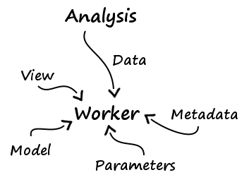

# Théorie des analyses

Une analyse est un ensemble d'opérations sur des données. Ces opérations 
peuvent être regroupées en trois catégories :

* **Traitement :** on modifie les données
* **Affichage :** on génère une vue des données, afin de pouvoir les exploiter 
aisément (graphe, pdf...)
* **Sauvegarde :** on sauvegarde les données afin de pouvoir les réutiliser sans 
avoir à les recalculer (système de cache)

Par exemple :

* **Données :** la production par jour pour une vache fixée et toutes ses 
lactations
* **Première analyse :** identité
    * **Traitement :** rien
    * **Affichage :** graphe de `prod = f(jour)` pour chaque lactation
    * **Sauvegarde :** sérialisation
* **Seconde analyse :** moyenne mobile
    * **Traitement :** moyenne mobile
    * **Affichage :** graphe de `prod = f(jour)` lissé pour chaque lactation
    * **Sauvegarde :** sérialisation
* **Troisième analyse :** régression linéaire
    * **Traitement :** régression linéaire
    * **Affichage :** PDF contenant des informations telles que l'erreur de 
l'approximation
    * **Sauvegarde :** sérialisation

Mais la troisième opération ne suit pas nécessairement la seconde, puisque l'on 
peut souhaiter agir sur les données brutes. Il faut donc utiliser un modèle non 
linéaire.

## Structure des analyses

On représentera les analyses par un graphe orienté et acyclique. On obtient 
cela :

    

On se rend alors compte que la structure des données à la fin d'une analyse 
doit être compréhensible pour l'analyse suivante. En pratique cela n'a pas 
d'importance puisqu'on indiquera où lire les données dont on a besoin.

## Les paramètres

Il faudra spécifier des paramètres pour les analyses :

* Quel affichage (graphe, PDF...) employer
* Sous quel chemin sauvegarder
* Quels paramètres pour le calcul
* Où lire les données dont on a besoin

